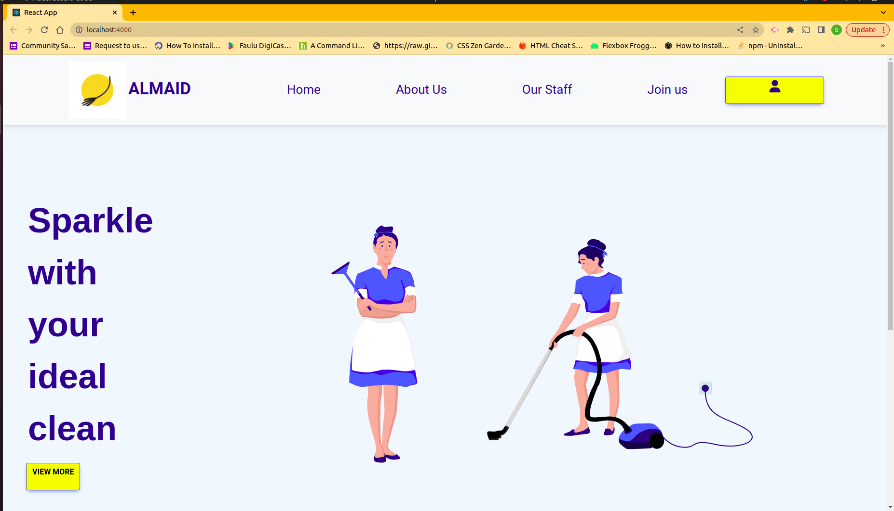
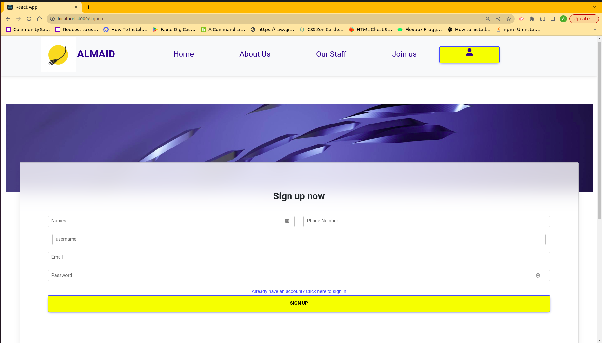
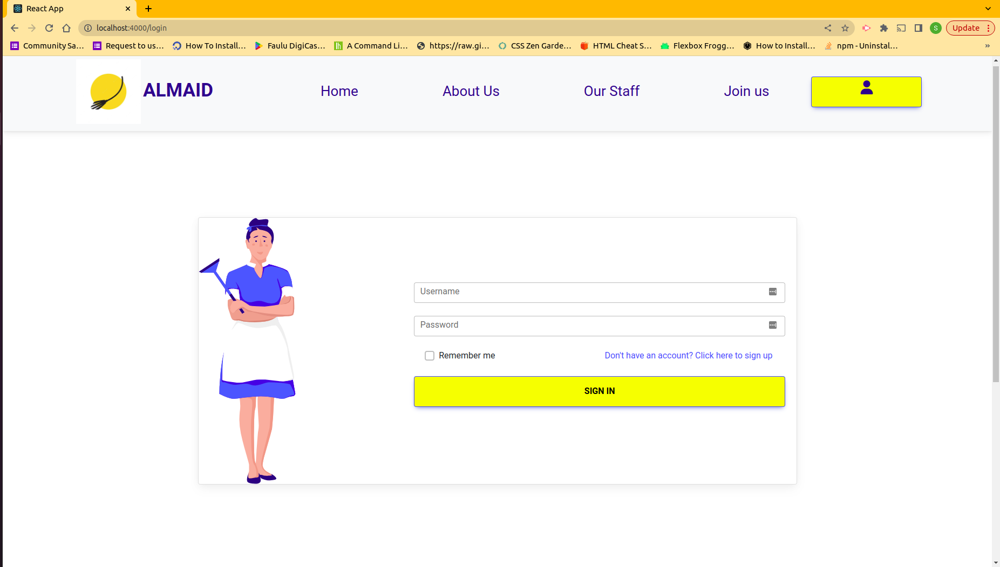

# Almaid

# About the project
Almaid is a React app built with a Ruby on Rails backend. It is designed to provide an efficient and reliable platform for people looking to hire household helps where they can make bookings and reviews. Also, people seeking cleaning jobs can also login to the site and upload their personal details to be reviewed/booked by potential clients.

* The following image demonstrates the application functionality:
Homepage:

User signup:

Login page:


[Figma design link](https://www.figma.com/file/DidMNdENMiX3W1VXiFNNRN/Phase-4-project?node-id=0-1&t=wjQFciRpKjS6Nkks-0)

## Setup Requirements
* Ruby version : **2.7.4**
* Postman (for testing API endpoints)
* React Router Dom version 6

## Setup Installation
```
    * Clone the repository
    * To set up the backend, run:
        - bundle install
    * To set up the frontend, run:    
        - npm install --prefix client
    * Run the following commands to get the entire project running:
        - foreman start -f Procfile.dev  
    * On the client directory, run the following command to install react-roter-dom
        - npm install react-router-dom@6
```

## Endpoints

> POST
```
    /users
```

* Create a new user
```
    {
        name: "string",
        tel_no: "string",
        email: "string",
        password: "string",
        username:"string"
    }
```

* Response
```
    201 Created
```

> POST (Login)
```
    /login
```

* User login
```
    {
        username: "string",
        password: "string"
    }
```

* Response
```
    201 created
```


> DELETE (Logout)
```
    /logout
```

* Response
```
    []
```

> POST Reviews
```
    /cleaners/${id}/reviews
```

* Create reviews
```
    {
        review: "string",
        rating: :"float",
        cleaner_id: "integer",
        user_id: "integer"
    }
```

* Response
```
    201 Created
```


> POST Bookings
```
    /bookings
```

* Create booking
```
    {
        cleaner_id: "integer",
        start_date: "date",
        end_date: "date",
        payment_status: "string"
    }
```

* Response
```
    {
        "success" : "Booking made"
    }
```